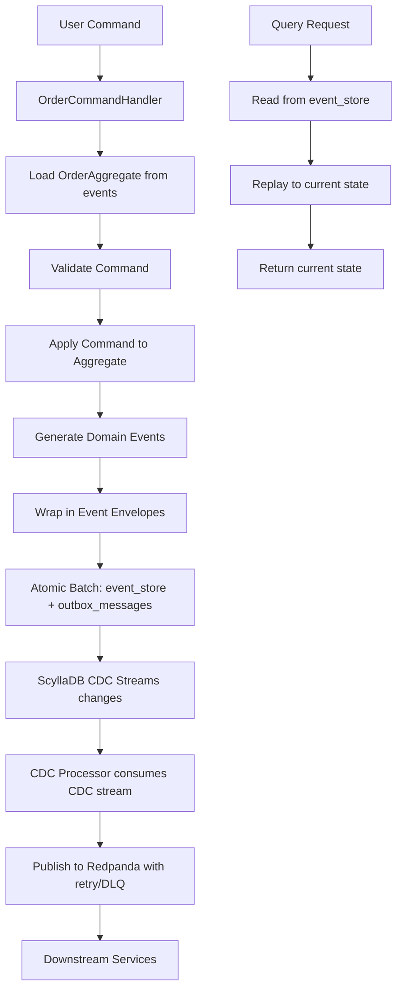

# ScyllaDB Event Sourcing with CDC

An Event Sourcing implementation using ScyllaDB CDC and Redpanda, built with Rust and the Actix actor model.

## What This Project Demonstrates

This project showcases **Event Sourcing** and **CQRS** patterns with CDC streaming:

- **Event Sourcing** - Events as source of truth
- **CQRS** - Separate write/read models
- **CDC Streaming** - Direct CDC consumption for projections
- **Outbox Pattern** - Reliable event publishing
- **Actor Supervision** - Fault-tolerant architecture
- **DLQ & Retry** - Production error handling
- **Prometheus Metrics** - Observability

## Architecture



### Key Components

**Event Sourcing**:
- `EventStore` - Append-only event log (source of truth)
- `OrderAggregate` - Domain logic with business rules
- `OrderCommandHandler` - Validates commands, emits events
- `EventEnvelope` - Metadata (causation, correlation, versioning)

**CDC Streaming**:
- `CdcProcessor` - Streams from `outbox_messages` table
- Direct CDC consumption for projections (no polling)
- External publishing via Redpanda

**Infrastructure**:
- `CoordinatorActor` - Actor supervision tree
- `DlqActor` - Dead letter queue for failed messages
- `HealthCheckActor` - System health monitoring
- Prometheus metrics on `:9090/metrics`

## Quick Start

### Prerequisites

- Rust 1.70+
- Docker & Docker Compose
- ScyllaDB (via Docker)
- Redpanda (via Docker)

### 1. Start Infrastructure with Schema (Recommended)

```bash
make dev
```

This command:
- Starts ScyllaDB and Redpanda with `docker-compose up -d`
- Waits for services to be ready (~25 seconds)
- Initializes all required schemas automatically:
  - `event_store` - Event log (source of truth)
  - `outbox_messages` - CDC-enabled outbox (WITH cdc = {'enabled': true})
  - `aggregate_sequence` - Optimistic locking and version tracking
  - `dead_letter_queue` - Failed messages
- Runs the application with logging enabled

### 2. Alternative: Separate Commands

If you prefer to run commands separately:

```bash
# Clean restart (recommended for first run)
make reset

# Or just start infrastructure
make reset  # includes docker-compose and schema initialization

# Run the application
make run
```

Watch the demo execute a complete order lifecycle:
1. **Create** order with items
2. **Confirm** order
3. **Ship** order with tracking
4. **Deliver** order with signature

Each command:
- Validates business rules
- Emits domain events
- Writes atomically to `event_store` + `outbox_messages`
- Streams via CDC to Redpanda

## Monitoring

- **Metrics**: http://localhost:9090/metrics
- **Redpanda Console**: http://localhost:8080 (if configured)
- **Logs**: Structured logging with tracing

## Project Structure

```
src/
├── event_sourcing/          # Generic Event Sourcing infrastructure
│   ├── core/                # Core abstractions (Aggregate, EventEnvelope)
│   │   ├── aggregate.rs     # Generic Aggregate trait
│   │   └── event.rs         # EventEnvelope and DomainEvent trait
│   └── store/               # Generic persistence layer
│       ├── event_store.rs   # Generic EventStore implementation
│       └── ...              # Future store components
├── domain/                  # Domain-specific logic
│   ├── order/               # Order aggregate and related types
│   │   ├── aggregate.rs     # OrderAggregate implementation
│   │   ├── commands.rs      # OrderCommand enum
│   │   ├── events.rs        # OrderEvent enum and related events
│   │   ├── errors.rs        # OrderError enum
│   │   ├── value_objects.rs # OrderItem, OrderStatus, etc.
│   │   └── command_handler.rs # OrderCommandHandler
│   ├── customer/            # Customer aggregate (example)
│   │   ├── aggregate.rs     # CustomerAggregate implementation
│   │   ├── commands.rs      # CustomerCommand enum
│   │   ├── events.rs        # CustomerEvent enum and related events
│   │   ├── errors.rs        # CustomerError enum
│   │   ├── value_objects.rs # Customer-specific value objects
│   │   └── command_handler.rs # CustomerCommandHandler
│   └── ...                  # Future aggregates (product, payment, etc.)
├── actors/                  # Actor system for infrastructure
│   ├── core/                # Abstract actor traits
│   ├── infrastructure/      # Concrete infrastructure actors
│   │   ├── coordinator.rs   # Supervision tree manager
│   │   ├── cdc_processor.rs # CDC streaming with real ScyllaDB CDC
│   │   ├── dlq.rs           # Dead letter queue
│   │   └── health_monitor.rs # Health monitoring
│   └── mod.rs               # Actor module exports
├── db/                      # Database interaction
│   └── schema.cql           # ScyllaDB schema
├── messaging/               # External messaging
│   └── redpanda_client.rs   # Redpanda/Kafka integration
├── utils/                   # Utility functions
│   └── retry.rs             # Retry with backoff and circuit breaker
├── metrics/                 # Prometheus metrics
│   └── metrics.rs           # Metrics definitions and server
└── main.rs                  # Application entry point
```

## 🎓 Event Sourcing Concepts

### Commands
User intentions that MAY succeed:
```rust
OrderCommand::CreateOrder { customer_id, items }
OrderCommand::ConfirmOrder
OrderCommand::ShipOrder { tracking_number, carrier }
```

### Events
Facts that DID happen (immutable):
```rust
OrderEvent::Created { customer_id, items }
OrderEvent::Confirmed { confirmed_at }
OrderEvent::Shipped { tracking_number, carrier, shipped_at }
```

### Aggregate
Domain model that:
- Validates commands
- Emits events
- Rebuilds state from events
- Enforces business rules

```rust
// Command validation
if order.status != OrderStatus::Confirmed {
    return Err(OrderError::NotConfirmed);
}
```

### Event Store
Append-only log:
- Events NEVER deleted or modified
- Current state = replay all events
- Full audit trail
- Time travel debugging

### Projections
Read models built from events:
- `order_read_model` - Current order state
- `orders_by_customer` - Customer's orders
- `orders_by_status` - Operational dashboards
- Can be rebuilt at any time

## CDC Architecture

### Real ScyllaDB CDC Implementation

The actual implementation uses the official `scylla-cdc` Rust library to consume directly from ScyllaDB's CDC log tables in real-time:

```
event_store + outbox_messages (WITH cdc = {'enabled': true})
         ↓
CDC Log Tables (hidden, created automatically by ScyllaDB)
         ↓
scylla-cdc library → OutboxCDCConsumer → Publish to Redpanda
         ↓
Real-time streaming with generation handling, checkpointing, and retry
```

**Real Implementation Features**:
- TRUE STREAMING: No polling, real-time event delivery
- Low latency (~50ms typical)
- Generation handling: Automatically handles schema changes
- Direct consumption from CDC log tables
- Built-in checkpointing and resumption
- Retry with backoff and circuit breaker
- Dead Letter Queue for failed events
- Fault isolation with actor supervision
- Multiple parallel consumers per VNode group

## Event Sourcing Features

### Implemented ✅

- [x] Generic Event Sourcing Infrastructure (Aggregate trait, EventEnvelope, EventStore)
- [x] Domain-Driven Design with clear aggregate boundaries
- [x] Order and Customer aggregates with full business logic
- [x] Command handlers orchestrating Command → Aggregate → Events → Event Store
- [x] Event metadata (causation, correlation, versioning)
- [x] Optimistic concurrency control with version tracking
- [x] Atomic write to event_store + outbox using ScyllaDB batches
- [x] Real ScyllaDB CDC streaming using scylla-cdc library
- [x] DLQ for failed messages with actor supervision
- [x] Retry with exponential backoff and circuit breaker
- [x] Prometheus metrics and health monitoring
- [x] Actor supervision tree for fault tolerance
- [x] Multi-aggregate support (Order, Customer examples)
- [x] Complete order lifecycle (Create, Confirm, Ship, Deliver, Cancel)

### Ready to Implement 🚧

- [ ] Read model projections (for optimized queries)
- [ ] Aggregate snapshots (for performance with high-event aggregates)
- [ ] Event upcasting (for schema evolution)
- [ ] Advanced monitoring and alerting
- [ ] More aggregate examples (Product, Payment, etc.)

## Usage Example

```rust
use event_sourcing::store::EventStore;
use domain::order::{OrderCommandHandler, OrderCommand, OrderItem, OrderEvent};
use std::sync::Arc;

// Initialize generic event store with concrete event type
let event_store = Arc::new(EventStore::<OrderEvent>::new(
    session.clone(),
    "Order",         // aggregate type name
    "order-events"   // topic name
));

// Create command handler
let command_handler = Arc::new(OrderCommandHandler::new(event_store.clone()));

// Execute command
let version = command_handler.handle(
    order_id,
    OrderCommand::CreateOrder {
        order_id,
        customer_id,
        items: vec![
            OrderItem {
                product_id: uuid::Uuid::new_v4(),
                quantity: 2,
            },
        ],
    },
    correlation_id,
).await?;

// Events are now in:
// - event_store (permanent, source of truth)
// - outbox_messages (CDC streams this to Redpanda)

// Real CDC processor will consume from outbox_messages CDC log
// and publish to Redpanda with retry and DLQ capabilities
```

## Testing

```bash
# Run tests (using Makefile)
make test

# Run with logs (manual command)
RUST_LOG=debug cargo test

# Test specific module (manual command)
cargo test event_sourcing::aggregate::tests
```

Tests cover:
- Aggregate lifecycle
- Business rule enforcement
- Event application
- Status transitions
- Concurrency conflicts

## Documentation

Comprehensive documentation is available in the [documentation index](./docs/INDEX.md), which provides a complete overview of all available documentation:

- **[Documentation Index](./docs/INDEX.md)** - Start here for all project documentation
- **[Main Tutorial](docs/TUTORIAL.md)** - Complete Event Sourcing tutorial with  diagrams

Additional reference: [`src/db/schema.cql`](./src/db/schema.cql) - Annotated database schema

## Configuration

### Environment Variables

```bash
RUST_LOG=info                    # Log level
SCYLLA_NODES=127.0.0.1:9042      # ScyllaDB contact points
REDPANDA_BROKERS=127.0.0.1:9092  # Redpanda brokers
METRICS_PORT=9090                # Prometheus metrics port
```

### docker-compose.yml

Customize:
- ScyllaDB memory limits
- Redpanda configuration
- Port mappings

## Troubleshooting

### Schema Not Found

```bash
cqlsh -f src/db/schema.cql
```

### Connection Refused

Check services are running:
```bash
docker-compose ps
```

### Concurrency Conflicts

Normal for event sourcing - command handler will retry.

### CDC Not Streaming

Verify CDC is enabled:
```sql
DESC TABLE orders_ks.outbox_messages;
-- Should show: cdc = {'enabled': true}
```

## Production Considerations

### Performance

Current implementation uses single inserts for clarity. For production:

**Use Batches**:
```rust
let mut batch = Batch::default();
batch.append_statement("INSERT INTO event_store ...");
batch.append_statement("INSERT INTO outbox_messages ...");
session.batch(&batch, values).await?;
```

### Scalability

- **Horizontal**: Add more ScyllaDB nodes
- **Partitioning**: Aggregate ID is partition key
- **Snapshots**: Every 100 events (schema ready)
- **Read models**: Independent scaling per projection

### Monitoring

Watch:
- Event store write latency
- CDC consumer lag
- DLQ message count
- Circuit breaker state
- Projection lag

## References

- [Event Sourcing by Martin Fowler](https://martinfowler.com/eaaDev/EventSourcing.html)
- [CQRS by Greg Young](https://cqrs.files.wordpress.com/2010/11/cqrs_documents.pdf)
- [ScyllaDB CDC](https://docs.scylladb.com/stable/using-scylla/cdc/)
- [Outbox Pattern](https://microservices.io/patterns/data/transactional-outbox.html)

## Contributing

This is an educational project. Contributions welcome:

1. Fork the repository
2. Create a feature branch
3. Make your changes
4. Add tests
5. Submit a pull request

## License

MIT License - see LICENSE file for details

---

**Built with** 🦀 Rust +  ScyllaDB +  Redpanda
