# Visual understanding of the distributed systems issues and the problem this small project is trying to address using ScyllaDB + Rust + Actix ecosystem.

## Table of Contents

1. [The Dual-Write Problem](#the-dual-write-problem)
2. [Outbox Pattern Solution](#outbox-pattern-solution)
3. [CDC Architecture](#cdc-architecture)
4. [Retry Flow Diagram](#retry-flow-diagram)
5. [Actor Supervision Tree](#actor-supervision-tree)
6. [Circuit Breaker State Machine](#circuit-breaker-state-machine)
7. [Complete Data Flow](#complete-data-flow)
8. [Failure Scenarios](#failure-scenarios)

---

## The Dual-Write Problem

### Naive Approach (Problematic)

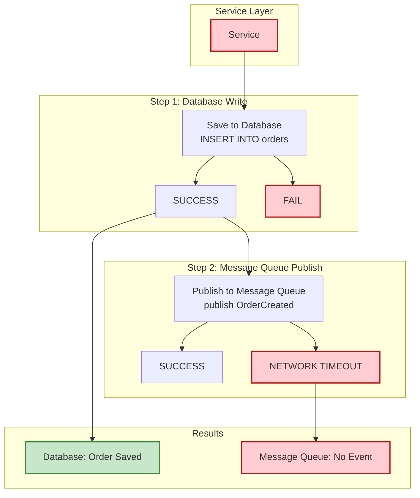

**PROBLEM**: Inconsistent state!
- Order exists in database
- Downstream services never notified
- Inventory not updated
- Customer not emailed

### Timing Diagram: Failure Scenarios

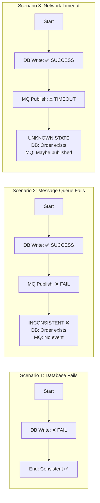

---

## Outbox Pattern Solution

### Correct Approach

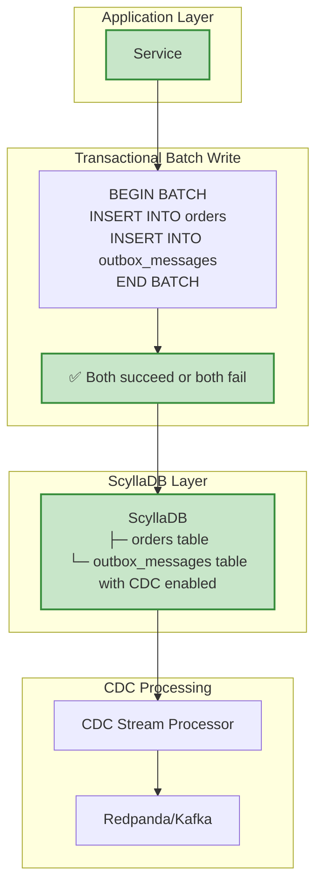

### Timing Diagram: Outbox Pattern

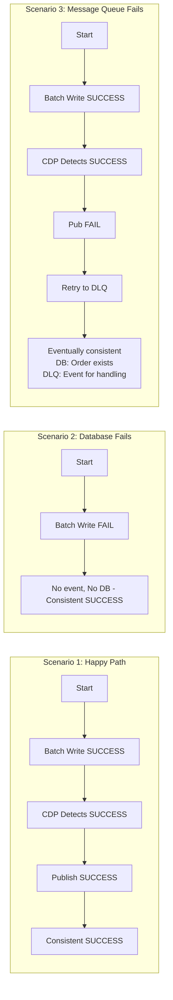

---

## CDC Architecture

### How CDC Works in ScyllaDB

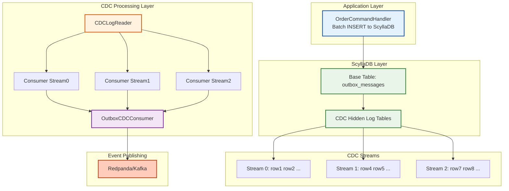

### CDC Stream Distribution

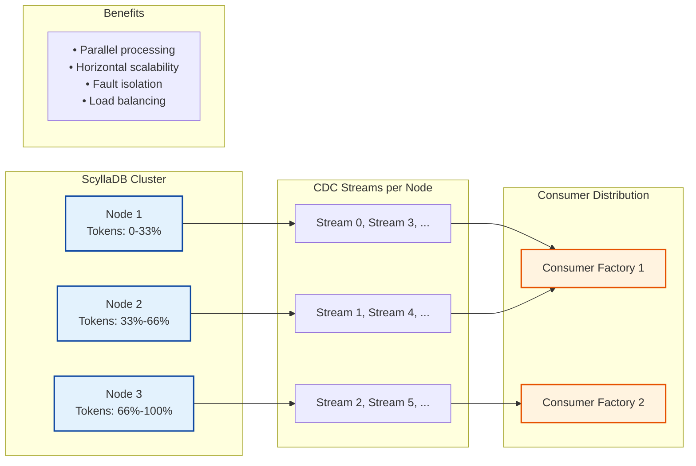

---

## Retry Flow Diagram

### Retry with Exponential Backoff

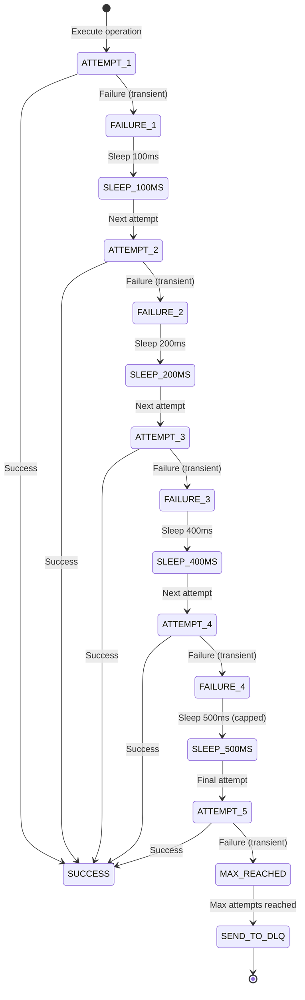

**State Notes:**
- **SUCCESS**: Return RetryResult::Success, Total time: varies, Attempts: 1-N
- **SEND_TO_DLQ**: Return RetryResult::Failed, Send to DLQ for manual processing, Total time: ~1.2 seconds, Backoff: 0,100,200,400,500ms

### Retry Decision Tree

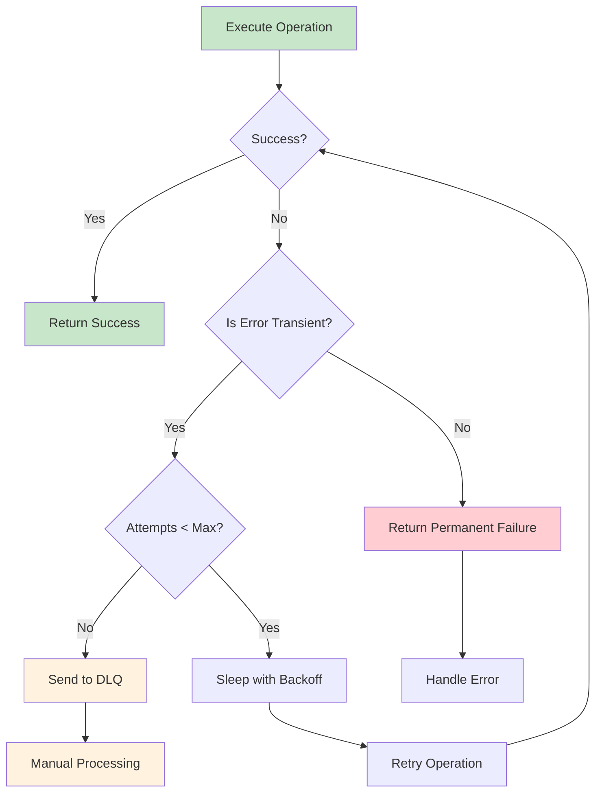

---

## Actor Supervision Tree

The system uses actors only for infrastructure components, not for domain logic:

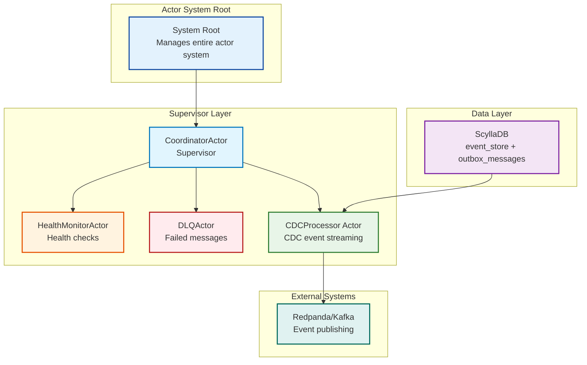

**Supervision Policies:**
```
Actor                Policy               Action on Failure
─────────────────────────────────────────────────────────
CoordinatorActor     N/A (root)          System shutdown
HealthMonitorActor   Resume              Log error, continue
DlqActor             Resume              Log error, continue
CdcProcessor         Restart             Recreate consumer
```

**Message Flow:**
```
1. Command Handler → ScyllaDB (batched write - event_store + outbox)
2. ScyllaDB → CdcProcessor (CDC stream)
3. CdcProcessor → RedpandaClient (publish with retry)
4. On failure → DlqActor (store failed message)
5. HealthMonitorActor → All actors (periodic health checks)
```

**Important**: Domain logic (Order Aggregate, OrderCommandHandler) are pure Rust components, NOT actors.

---

## Circuit Breaker State Machine

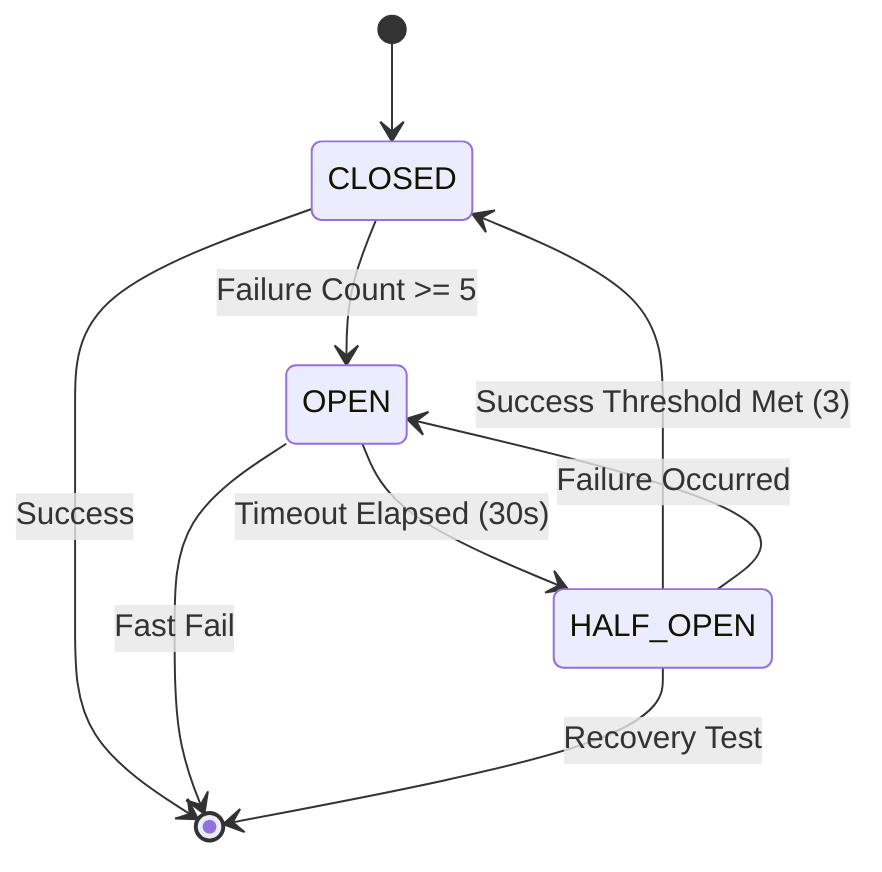

**State Details:**
- **CLOSED**: 
  - Normal operation
  - All calls allowed
  - Track failures
  - Threshold typically 5 failures
- **OPEN**:
  - Timeout typically 30 seconds
- **HALF_OPEN**:
  - Typically 3 successful calls needed

**State Transition Table:**
```
From State  │ Event              │ To State    │ Action
────────────┼────────────────────┼─────────────┼──────────
CLOSED      │ failure_count >= 5 │ OPEN        │ Block calls
CLOSED      │ success            │ CLOSED      │ Reset counter
OPEN        │ timeout elapsed    │ HALF_OPEN   │ Allow test
OPEN        │ call attempted     │ OPEN        │ Reject fast
HALF_OPEN   │ success (count=3)  │ CLOSED      │ Resume
HALF_OPEN   │ any failure        │ OPEN        │ Block again
```

**Timing Example:**
```
T0:    CLOSED - call succeeds (failure_count = 0)
T1:    CLOSED - call fails (failure_count = 1)  
T2:    CLOSED - call fails (failure_count = 2)
T3:    CLOSED - call fails (failure_count = 3)
T4:    CLOSED - call fails (failure_count = 4)
T5:    CLOSED - call fails (failure_count = 5)
T6:    -> OPEN (threshold reached)
T7-35: OPEN - all calls rejected immediately
T36:   -> HALF_OPEN (30s timeout elapsed)
T37:   HALF_OPEN - test call succeeds (success_count = 1)
T38:   HALF_OPEN - test call succeeds (success_count = 2)
T39:   HALF_OPEN - test call succeeds (success_count = 3)
T40:   -> CLOSED (recovery confirmed)
```

---

## Complete Data Flow

### End-to-End: Order Creation to Event Delivery

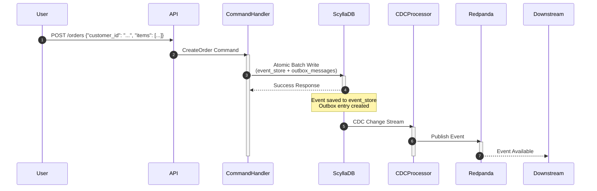

**Step-by-Step Process:**

1. **User Request** → HTTP Handler (Not shown in this project)
   ```
   ┌──────────┐
   │   User   │ POST /orders {"customer_id": "...", "items": [...]}
   └─────┬────┘
         │
         ▼
   ┌──────────────────┐
   │  HTTP Handler    │
   │  (Not shown in   │
   │   this project)  │
   └─────┬────────────┘
   ```

2. **Command Processing** → OrderCommandHandler
   ```
   ┌──────────────────────────────────────────────────────┐
   │              OrderCommandHandler::handle()           │
   │                                                      │
   │  1. Load OrderAggregate from events                 │
   │  2. Validate CreateOrder command                    │
   │  3. Apply command to create OrderCreatedEvent       │
   │  4. Call EventStore.append_events()                 │
   │     ├─► Prepare batch                               │
   │     ├─► Add to event_store                          │
   │     ├─► Add to outbox_messages                      │
   │     └─► Execute atomically                          │
   └──────────────────┬───────────────────────────────────┘
   ```

3. **Database Write** → ScyllaDB
   ```
   ┌──────────────────────────────────────────────────────┐
   │                   ScyllaDB                           │
   │                                                      │
   │  BEGIN BATCH;                                        │
   │    INSERT INTO event_store                           │
   │      (aggregate_id, sequence_number, event_id,      │
   │       event_type, event_version, event_data, ...)   │
   │    VALUES (?, ?, ?, 'OrderCreated', 1, ...);        │
   │                                                      │
   │    INSERT INTO outbox_messages                       │
   │      (id, aggregate_id, event_type, payload, ...)   │
   │    VALUES (?, ?, 'OrderCreated', '{"order_id":...}',│
   │             ...);                                    │
   │  APPLY BATCH;                                        │
   │                                                      │
   │  ✅ Both writes succeed atomically                   │
   └──────────────────┬───────────────────────────────────┘
   ```

4. **CDC Capture** → CDC Hidden Log Tables
   ```
   ┌──────────────────────────────────────────────────────┐
   │            CDC Hidden Log Tables                     │
   │                                                      │
   │  Stream 0: [..., new_row, ...]                      │
   │  Stream 1: [...]                                     │
   │  Stream 2: [...]                                     │
   │                                                      │
   │  new_row = {                                         │
   │    operation: "RowInsert",                           │
   │    stream_id: 0,                                     │
   │    data: {                                           │
   │      id: UUID,                                       │
   │      aggregate_id: UUID,                             │
   │      event_type: "OrderCreated",                     │
   │      payload: '{"order_id": "..."}',                 │
   │      created_at: TIMESTAMP                           │
   │    }                                                 │
   │  }                                                   │
   │                                                      │
   └──────────────────┬───────────────────────────────────┘
   ```

5. **Consumer Processing** → OutboxCDCConsumer
   ```
   ┌──────────────────────────────────────────────────────┐
   │     OutboxCDCConsumer::consume_cdc()                 │
   │                                                      │
   │  1. Receive CDCRow                                   │
   │  2. Extract event data                               │
   │     ├─► id                                           │
   │     ├─► aggregate_id                                 │
   │     ├─► event_type                                   │
   │     └─► payload                                      │
   │                                                      │
   │  3. Attempt publish with retry                       │
   │     ├─► Attempt 1: immediate                         │
   │     ├─► Attempt 2: after 100ms (if failed)           │
   │     ├─► Attempt 3: after 200ms (if failed)           │
   │     ├─► Attempt 4: after 400ms (if failed)           │
   │     └─► Attempt 5: after 500ms (if failed)           │
   └──────────────────┬───────────────────────────────────┘
   ```

**Latency Breakdown (Happy Path):**
```
Operation                      Latency
─────────────────────────────────────────────────────────
1. User request → Command Handler  ~1ms
2. Command processing            ~0.5ms
3. ScyllaDB batch write        ~2-5ms (local)
4. CDC capture                 ~50-100ms
5. Consumer processing         ~1ms
6. Redpanda publish            ~2-5ms (local)
─────────────────────────────────────────────────────────
Total end-to-end:              ~60-120ms

With retries (worst case):     ~1.2s + base latency
```

---

## Failure Scenarios

### Scenario Matrix

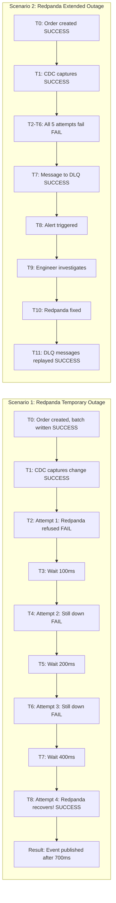

**Impact Summary:**
```
Scenario 1: Redpanda Temporary Outage
───────
- Order saved: YES
- Event eventually published: YES
- User notified: YES (order confirmed)
- Downstreams notified: YES (delayed ~700ms)

Scenario 2: Redpanda Extended Outage
───────
- Order saved: YES
- Event in DLQ: YES
- User notified: YES (order confirmed)
- Downstreams notified: NO (waiting on manual replay)
- SLA: Degraded, but no data loss

Scenario 3: ScyllaDB Write Failure
───────
- Order saved: NO
- Event published: NO
- User notified: NO (received error response)
- System state: Consistent (nothing saved) YES

Scenario 4: Partial CDC Processing Failure
───────
- Orders saved: YES (all 100)
- Events published: YES (50 immediate + 50 after recovery)
- Circuit breaker prevented cascading failure YES
- Total delay for last 50: ~30s

Scenario 5: Consumer Crash
───────
- Orders saved: YES
- Events eventually published: YES
- Possible duplicates: Handled by idempotency YES
- Downtime: ~1-2 seconds
```

**Recovery Decision Tree:**
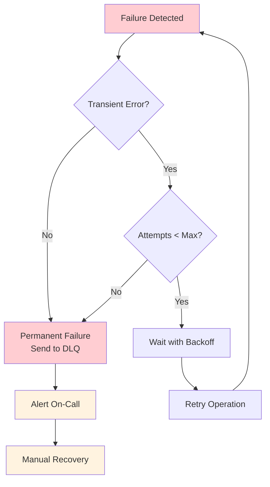

**Note that most of the numbers in this document are experimental and would vary based on environment, network, and load.**
---

## Documentation Links

- [Return to Documentation Index](INDEX.md) - Back to the main documentation index
- [Return to README](../README.md) - Back to main project page
- [Main Tutorial](TUTORIAL.md) - Complete Event Sourcing tutorial with rich diagrams