# Event Sourcing with ScyllaDB CDC: A Complete Tutorial

## ⚠️ Experimental Purpose

**This project is designed purely for experimental purposes**, even though it may contain elements that suggest production-readiness. If you are building production systems, please consider using battle-tested frameworks that have been proven over years of production use:

- **Axon Framework** - Java-based, enterprise-grade Event Sourcing framework
- **Akka** - Actor model framework with strong Event Sourcing capabilities
- Other mature Event Sourcing frameworks in various languages

Most Event Sourcing frameworks for Rust are still premature and untested in production environments. Many practitioners I'm  aware of essentially build the nuts and bolts themselves when deploying to production.

This project exists to share a glimpse of **one opinionated approach** to implementing Event Sourcing with Rust + ScyllaDB as a starting point for learning and experimentation. **Have fun** exploring these patterns!

## About This Tutorial

This tutorial demonstrates a complete Event Sourcing implementation using ScyllaDB Change Data Capture (CDC) for real-time event streaming. The solution addresses critical challenges in distributed systems, including data consistency, audit trails, and reliable event publishing.

The project showcases how to combine Event Sourcing, CQRS (Command Query Responsibility Segregation), and CDC to build resilient, scalable systems with Rust and ScyllaDB.

## Why Event Sourcing?

Traditional CRUD applications store the *current state* of entities in mutable tables. Event Sourcing changes this paradigm by storing an immutable log of *all state changes* (events). The current state is derived by replaying these events.

Key benefits:
- **Complete audit trail**: Every change is preserved forever
- **Time travel debugging**: Reconstruct state at any historical point
- **Business rule evolution**: Apply new rules to historical events
- **Compliance**: Immutable records for regulatory requirements
- **Analytics**: Rich dataset for business intelligence

## Project Architecture

### Core Architecture

The system follows an architecture that separates write operations from read operations using Change Data Capture:


The architecture separates into several key layers:

#### Domain Layer (NOT using Actors)
- **Aggregates**: Business logic containers (Order, Customer) - *Pure Rust structs with methods*
- **Value Objects**: Immutable domain objects
- **Commands**: User intentions that may be rejected
- **Events**: Immutable facts that occurred
- **Command Handlers**: Orchestrate Command → Aggregate → Events flow - *Pure Rust, no actors*

#### Event Sourcing Infrastructure (NOT using Actors)
- **EventStore**: Generic persistence layer - *Pure Rust, no actors*
- **EventEnvelope**: Metadata wrapper for events
- **Aggregate Trait**: Contract for all aggregates

#### Infrastructure Actors (Only Infrastructure Uses Actors)
- **Coordinator Actor**: Supervises infrastructure actors
- **CDC Processor Actor**: Real-time event streaming consumer
- **Health Monitor Actor**: System health tracking
- **DLQ Actor**: Dead letter queue for failed messages
- **Outbox Pattern**: Reliable event publishing with atomic writes

**IMPORTANT**: Only infrastructure components use the Actor model. The domain logic (Aggregates, Command Handlers, Event Store) are pure Rust without actors.

### Database Schema

The system uses ScyllaDB with a carefully designed schema:

```cql
-- Event store (source of truth)
CREATE TABLE event_store (
    aggregate_id UUID,
    sequence_number BIGINT,
    event_id UUID,
    event_type TEXT,
    event_version INT,
    event_data TEXT,
    causation_id UUID,
    correlation_id UUID,
    timestamp TIMESTAMP,
    PRIMARY KEY (aggregate_id, sequence_number)
);

-- Aggregate sequence tracking for optimistic concurrency
CREATE TABLE aggregate_sequence (
    aggregate_id UUID PRIMARY KEY,
    current_sequence BIGINT,
    updated_at TIMESTAMP
);

-- Outbox with CDC enabled for streaming
CREATE TABLE outbox_messages (
    id UUID PRIMARY KEY,
    aggregate_id UUID,
    aggregate_type TEXT,
    event_id UUID,
    event_type TEXT,
    event_version INT,
    payload TEXT,
    topic TEXT,
    partition_key TEXT,
    causation_id UUID,
    correlation_id UUID,
    created_at TIMESTAMP,
    attempts INT
) WITH cdc = {'enabled': true};
```

## Implementation Deep Dive

### Generic Event Sourcing Infrastructure

The system provides a generic, reusable event sourcing infrastructure that works with any aggregate type:

```rust
use serde::{Deserialize, Serialize};
use uuid::Uuid;
use chrono::{DateTime, Utc};
use std::collections::HashMap;

/// Event Envelope wraps domain events with metadata
#[derive(Serialize, Deserialize, Clone, Debug)]
pub struct EventEnvelope<E> {
    // Identity and ordering
    pub event_id: Uuid,
    pub aggregate_id: Uuid,
    pub sequence_number: i64,

    // Event type information
    pub event_type: String,
    pub event_version: i32,

    // The actual event data
    pub event_data: E,

    // Distributed tracing metadata
    pub causation_id: Option<Uuid>,
    pub correlation_id: Uuid,

    // Timestamp
    pub timestamp: DateTime<Utc>,

    // Additional metadata
    pub metadata: HashMap<String, String>,
}

// Domain events must implement this trait
pub trait DomainEvent: Serialize + for<'de> Deserialize<'de> + Clone + Send + Sync {
    fn event_type() -> &'static str where Self: Sized;
    fn event_version() -> i32 where Self: Sized { 1 }
}
```

### Aggregate Pattern Implementation

Aggregates are the heart of the domain model, enforcing business rules and maintaining invariants:

```rust
use crate::event_sourcing::core::{Aggregate, EventEnvelope};

pub trait Aggregate: Sized + Send + Sync {
    type Event;
    type Command;
    type Error;

    /// Create aggregate from first event
    fn apply_first_event(event: &Self::Event) -> Result<Self, Self::Error>;

    /// Apply subsequent events
    fn apply_event(&mut self, event: &Self::Event) -> Result<(), Self::Error>;

    /// Handle command and emit events
    fn handle_command(&self, command: &Self::Command) -> Result<Vec<Self::Event>, Self::Error>;

    /// Get aggregate ID
    fn aggregate_id(&self) -> Uuid;

    /// Get current version
    fn version(&self) -> i64;

    /// Load aggregate from event history
    fn load_from_events(events: Vec<EventEnvelope<Self::Event>>) -> Result<Self>
    where
        Self::Error: std::fmt::Display;
}
```

### Real Order Aggregate Example

Here's how a real Order aggregate implements these patterns:

```rust
use serde::{Deserialize, Serialize};
use uuid::Uuid;
use chrono::{DateTime, Utc};
use crate::event_sourcing::core::Aggregate;
use super::value_objects::{OrderItem, OrderStatus};
use super::events::*;
use super::commands::OrderCommand;
use super::errors::OrderError;

#[derive(Debug, Clone, Serialize, Deserialize)]
pub struct OrderAggregate {
    pub id: Uuid,
    pub version: i64,
    pub customer_id: Uuid,
    pub items: Vec<OrderItem>,
    pub status: OrderStatus,
    pub created_at: DateTime<Utc>,
    pub updated_at: DateTime<Utc>,
    pub tracking_number: Option<String>,
    pub carrier: Option<String>,
    pub cancelled_reason: Option<String>,
}

impl Aggregate for OrderAggregate {
    type Event = OrderEvent;
    type Command = OrderCommand;
    type Error = OrderError;

    fn apply_first_event(event: &Self::Event) -> Result<Self, Self::Error> {
        match event {
            OrderEvent::Created(e) => {
                let now = Utc::now();
                Ok(Self {
                    id: Uuid::new_v4(),
                    version: 0,
                    customer_id: e.customer_id,
                    items: e.items.clone(),
                    status: OrderStatus::Created,
                    created_at: now,
                    updated_at: now,
                    tracking_number: None,
                    carrier: None,
                    cancelled_reason: None,
                })
            }
            _ => Err(OrderError::NotInitialized),
        }
    }

    fn apply_event(&mut self, event: &Self::Event) -> Result<(), Self::Error> {
        self.updated_at = Utc::now();

        match event {
            OrderEvent::Created(_) => Ok(()),
            OrderEvent::ItemsUpdated(e) => {
                self.items = e.items.clone();
                Ok(())
            }
            OrderEvent::Confirmed(_) => {
                self.status = OrderStatus::Confirmed;
                Ok(())
            }
            OrderEvent::Shipped(e) => {
                self.status = OrderStatus::Shipped;
                self.tracking_number = Some(e.tracking_number.clone());
                self.carrier = Some(e.carrier.clone());
                Ok(())
            }
            OrderEvent::Delivered(_) => {
                self.status = OrderStatus::Delivered;
                Ok(())
            }
            OrderEvent::Cancelled(e) => {
                self.status = OrderStatus::Cancelled;
                self.cancelled_reason = e.reason.clone();
                Ok(())
            }
        }
    }

    fn handle_command(&self, command: &Self::Command) -> Result<Vec<Self::Event>, Self::Error> {
        match command {
            OrderCommand::ConfirmOrder => {
                match self.status {
                    OrderStatus::Created => {}
                    OrderStatus::Confirmed => return Err(OrderError::AlreadyConfirmed),
                    _ => return Err(OrderError::InvalidStatusTransition(self.status.clone())),
                }

                Ok(vec![OrderEvent::Confirmed(OrderConfirmed {
                    confirmed_at: Utc::now(),
                })])
            }
            // Additional command handlers...
        }
    }

    fn aggregate_id(&self) -> Uuid {
        self.id
    }

    fn version(&self) -> i64 {
        self.version
    }

    fn load_from_events(events: Vec<EventEnvelope<Self::Event>>) -> Result<Self> {
        if events.is_empty() {
            bail!("Cannot load aggregate from empty event list");
        }

        // Apply first event to create aggregate
        let first = &events[0];
        let mut aggregate = Self::apply_first_event(&first.event_data)
            .map_err(|e| anyhow::anyhow!("Failed to apply first event: {}", e))?;

        // Set version from first event
        aggregate.version = first.sequence_number;

        // Apply remaining events
        for envelope in events.iter().skip(1) {
            aggregate.apply_event(&envelope.event_data)
                .map_err(|e| anyhow::anyhow!("Failed to apply event: {}", e))?;
            aggregate.version = envelope.sequence_number;
        }

        Ok(aggregate)
    }
}
```

### Event Store Implementation

The generic EventStore handles persistence with optimistic concurrency control:

```rust
pub struct EventStore<E: DomainEvent> {
    session: Arc<Session>,
    aggregate_type_name: String,
    topic_name: String,
    _phantom: PhantomData<E>,
}

impl<E: DomainEvent> EventStore<E> {
    /// Append events with optimistic concurrency control
    pub async fn append_events(
        &self,
        aggregate_id: Uuid,
        expected_version: i64,
        events: Vec<EventEnvelope<E>>,
        publish_to_outbox: bool,
    ) -> Result<i64> {
        if events.is_empty() {
            bail!("Cannot append empty event list");
        }

        // Check optimistic concurrency
        let current_version = self.get_current_version(aggregate_id).await?;
        if current_version != expected_version {
            bail!(
                "Concurrency conflict: expected version {}, but current is {}",
                expected_version,
                current_version
            );
        }

        // Prepare batch for atomic write
        let mut batch = scylla::statement::batch::Batch::default();
        let mut values: Vec<Box<dyn scylla::serialize::row::SerializeRow>> = vec![];

        let mut new_version = expected_version;

        // Build batch statements and values
        for event_envelope in &events {
            new_version += 1;

            let event_json = serialize_event(&event_envelope.event_data)?;

            // Insert into event_store
            batch.append_statement(
                "INSERT INTO event_store (
                    aggregate_id, sequence_number, event_id, event_type, event_version,
                    event_data, causation_id, correlation_id, timestamp
                ) VALUES (?, ?, ?, ?, ?, ?, ?, ?, ?)"
            );

            values.push(Box::new((
                aggregate_id,
                new_version,
                event_envelope.event_id,
                event_envelope.event_type.clone(),
                event_envelope.event_version,
                event_json.clone(),
                event_envelope.causation_id,
                event_envelope.correlation_id,
                event_envelope.timestamp,
            )));

            // If publishing to outbox, add outbox entry
            if publish_to_outbox {
                batch.append_statement(
                    "INSERT INTO outbox_messages (
                        id, aggregate_id, aggregate_type, event_id, event_type, event_version,
                        payload, topic, partition_key, causation_id, correlation_id,
                        created_at, attempts
                    ) VALUES (?, ?, ?, ?, ?, ?, ?, ?, ?, ?, ?, ?, 0)"
                );

                let partition_key = aggregate_id.to_string();

                values.push(Box::new((
                    Uuid::new_v4(), // outbox message id
                    aggregate_id,
                    self.aggregate_type_name.clone(),
                    event_envelope.event_id,
                    event_envelope.event_type.clone(),
                    event_envelope.event_version,
                    event_json,
                    self.topic_name.clone(),
                    partition_key,
                    event_envelope.causation_id,
                    event_envelope.correlation_id,
                    Utc::now(),
                )));
            }
        }

        // Update aggregate sequence
        batch.append_statement(
            "INSERT INTO aggregate_sequence (aggregate_id, current_sequence, updated_at) VALUES (?, ?, ?)"
        );

        values.push(Box::new((aggregate_id, new_version, Utc::now())));

        // Execute batch atomically
        self.session.batch(&batch, values).await?;

        Ok(new_version)
    }
}
```

### Command Handlers

Command handlers orchestrate the flow from command to persisted events:

```rust
pub struct OrderCommandHandler {
    event_store: Arc<EventStore<OrderEvent>>,
}

impl OrderCommandHandler {
    /// Handle a command and persist resulting events
    pub async fn handle(
        &self,
        aggregate_id: Uuid,
        command: OrderCommand,
        correlation_id: Uuid,
    ) -> Result<i64> {
        // Load current aggregate state
        let exists = self.event_store.aggregate_exists(aggregate_id).await?;

        let (aggregate, expected_version) = if exists {
            let agg = self.event_store.load_aggregate::<OrderAggregate>(aggregate_id).await?;
            let ver = agg.version();
            (agg, ver)
        } else {
            match &command {
                OrderCommand::CreateOrder { .. } => {
                    let event = OrderEvent::Created(super::events::OrderCreated {
                        customer_id: Uuid::new_v4(),
                        items: vec![],
                    });
                    let agg = OrderAggregate::apply_first_event(&event)?;
                    (agg, 0) // Expected version is 0 for new aggregates
                }
                _ => bail!("Aggregate does not exist: {}", aggregate_id),
            }
        };

        // Handle command to get events
        let domain_events = aggregate.handle_command(&command)
            .map_err(|e| anyhow::anyhow!("Command failed: {}", e))?;

        // Wrap in envelopes
        let mut envelopes = Vec::new();
        let mut seq = expected_version;

        for domain_event in domain_events {
            seq += 1;
            let event_type = match &domain_event {
                OrderEvent::Created(_) => "OrderCreated",
                OrderEvent::ItemsUpdated(_) => "OrderItemsUpdated",
                OrderEvent::Confirmed(_) => "OrderConfirmed",
                OrderEvent::Shipped(_) => "OrderShipped",
                OrderEvent::Delivered(_) => "OrderDelivered",
                OrderEvent::Cancelled(_) => "OrderCancelled",
            };

            let envelope = EventEnvelope::new(
                aggregate_id,
                seq,
                event_type.to_string(),
                domain_event,
                correlation_id,
            );

            envelopes.push(envelope);
        }

        // Append to event store
        let new_version = self.event_store.append_events(
            aggregate_id,
            expected_version,
            envelopes,
            true, // publish to outbox
        ).await?;

        Ok(new_version)
    }
}
```

## Real-Time Event Streaming with CDC

### ScyllaDB CDC Integration

One of the standout features is the real-time processing of outbox events using ScyllaDB's Change Data Capture (CDC). This provides true streaming rather than polling:


The CDC processor consumes directly from ScyllaDB's CDC log tables, providing:

- **Real-time delivery**: Events flow immediately as they're written
- **Generation handling**: Automatically handles schema changes
- **Checkpointing**: Built-in progress tracking and resumption
- **Fault tolerance**: Independent consumer offset tracking

### CDC Consumer Implementation

```rust
use scylla_cdc::consumer::{Consumer, ConsumerFactory, CDCRow, OperationType};
use async_trait::async_trait;

pub struct OutboxCDCConsumer {
    redpanda: Arc<RedpandaClient>,
    dlq_actor: Option<Addr<DlqActor>>,
    retry_config: RetryConfig,
}

#[async_trait]
impl Consumer for OutboxCDCConsumer {
    async fn consume_cdc(&mut self, data: CDCRow<'_>) -> anyhow::Result<()> {
        tracing::debug!(
            stream_id = ?data.stream_id,
            operation = %data.operation,
            "Received CDC row"
        );

        // Extract event from CDC row
        match self.extract_event_from_cdc_row(&data)? {
            Some(event) => {
                tracing::info!(
                    event_id = %event.id,
                    event_type = %event.event_type,
                    aggregate_id = %event.aggregate_id,
                    "📤 Publishing event from CDC stream to Redpanda"
                );

                // Publish with retry
                let redpanda = self.redpanda.clone();
                let event_type = event.event_type.clone();
                let event_id = event.id;
                let aggregate_id = event.aggregate_id;
                let payload = event.payload.clone();
                let first_attempt_time = Utc::now();

                let result = retry_with_backoff(
                    self.retry_config.clone(),
                    |attempt| {
                        let redpanda = redpanda.clone();
                        let event_type = event_type.clone();
                        let event_id_str = event_id.to_string();
                        let payload = payload.clone();

                        async move {
                            tracing::debug!(
                                attempt = attempt,
                                event_id = %event_id,
                                "Attempting to publish event"
                            );

                            redpanda.publish(&event_type, &event_id_str, &payload).await
                        }
                    }
                ).await;

                match result {
                    RetryResult::Success(_) => {
                        tracing::info!(
                            event_id = %event_id,
                            event_type = %event_type,
                            "✅ Successfully published event via CDC stream"
                        );
                        Ok(())
                    }
                    RetryResult::Failed(e) | RetryResult::PermanentFailure(e) => {
                        tracing::error!(
                            error = %e,
                            event_id = %event_id,
                            event_type = %event_type,
                            "❌ Failed to publish event after retries, sending to DLQ"
                        );

                        // Send to Dead Letter Queue
                        if let Some(ref dlq) = self.dlq_actor {
                            dlq.do_send(AddToDlq {
                                id: event_id,
                                aggregate_id,
                                event_type: event_type.clone(),
                                payload,
                                error_message: e.to_string(),
                                failure_count: self.retry_config.max_attempts as i32,
                                first_failed_at: first_attempt_time,
                            });
                        }

                        Ok(())
                    }
                }
            }
            None => Ok(()), // Non-insert operation, nothing to publish
        }
    }
}
```

## Usage Examples

### Creating and Managing an Order

Here's a complete example of using the event sourcing system to manage an order lifecycle:

```rust
use event_sourcing::store::EventStore;
use domain::order::{OrderCommandHandler, OrderCommand, OrderItem, OrderEvent};
use std::sync::Arc;

#[tokio::main]
async fn main() -> anyhow::Result<()> {
    // Initialize ScyllaDB session
    let session = Arc::new(/* ScyllaDB session initialization */);

    // Create generic event store for Order events
    let event_store = Arc::new(EventStore::<OrderEvent>::new(
        session.clone(),
        "Order",         // aggregate type name
        "order-events"   // topic name
    ));

    // Create command handler
    let command_handler = Arc::new(OrderCommandHandler::new(event_store.clone()));

    let order_id = Uuid::new_v4();
    let customer_id = Uuid::new_v4();
    let correlation_id = Uuid::new_v4();

    // Create order
    println!("Creating order...");
    let version = command_handler.handle(
        order_id,
        OrderCommand::CreateOrder {
            order_id,
            customer_id,
            items: vec![
                OrderItem {
                    product_id: Uuid::new_v4(),
                    quantity: 2,
                },
                OrderItem {
                    product_id: Uuid::new_v4(),
                    quantity: 1,
                },
            ],
        },
        correlation_id,
    ).await?;
    println!("Order created: {} (version: {})", order_id, version);

    // Confirm order
    println!("Confirming order...");
    let version = command_handler.handle(
        order_id,
        OrderCommand::ConfirmOrder,
        correlation_id,
    ).await?;
    println!("Order confirmed (version: {})", version);

    // Ship order
    println!("Shipping order...");
    let version = command_handler.handle(
        order_id,
        OrderCommand::ShipOrder {
            tracking_number: "TRACK-123-XYZ".to_string(),
            carrier: "DHL Express".to_string(),
        },
        correlation_id,
    ).await?;
    println!("Order shipped (version: {})", version);

    // Deliver order
    println!("Delivering order...");
    let version = command_handler.handle(
        order_id,
        OrderCommand::DeliverOrder {
            signature: Some("John Doe".to_string()),
        },
        correlation_id,
    ).await?;
    println!("Order delivered (version: {})", version);

    // Load current aggregate state
    let order_aggregate = event_store.load_aggregate::<OrderAggregate>(order_id).await?;
    println!("Final order status: {:?}", order_aggregate.status);

    Ok(())
}
```

### Working with Multiple Aggregates

The system supports multiple aggregates that can each be developed independently:

```rust
// Customer event store
let customer_event_store = Arc::new(EventStore::<CustomerEvent>::new(
    session.clone(),
    "Customer",
    "customer-events"
));

let customer_command_handler = Arc::new(CustomerCommandHandler::new(customer_event_store.clone()));

// Register customer
let customer_id = Uuid::new_v4();
let customer_correlation_id = Uuid::new_v4();

let version = customer_command_handler.handle(
    customer_id,
    CustomerCommand::RegisterCustomer {
        customer_id,
        email: Email::new("john.doe@example.com"),
        first_name: "John".to_string(),
        last_name: "Doe".to_string(),
        phone: Some(PhoneNumber::new("+1-555-0123")),
    },
    customer_correlation_id,
).await?;
```

## Error Handling and Resilience

### Circuit Breaker Pattern

The system implements a circuit breaker pattern to prevent cascading failures:


**State Descriptions:**
- **Closed**: Normal operation, all calls allowed, track failures
- **Open**: Threshold typically 5 failures, timeout typically 30 seconds  
- **Half-Open**: Typically 3 successful calls needed for recovery test

### Retry with Exponential Backoff

The system implements robust error handling with configurable retry strategies:

```mermaid
flowchart TD
    A[Operation Execute] --> B{Success?}
    B -->|Yes| C[Return Success]
    B -->|No| D{Is Error Transient?}
    D -->|No| E[Return Permanent Failure]
    D -->|Yes| F{Attempts < Max?}
    F -->|Yes| G[Backoff Wait]
    G --> H[Retry Operation]
    H --> B
    F -->|No| I[Send to DLQ]
    E --> J[Handle Error]
    I --> K[Manual Processing]
    D -->|Yes| L{Check Circuit Breaker}
    L -->|Closed| F
    L -->|Open| M[Fast Fail - Immediate Return]
    M --> I
    L -->|Half-Open| F
    
    style A fill:#c8e6c9,stroke:#388e3c
    style C fill:#c8e6c9,stroke:#388e3c
    style E fill:#ffcdd2,stroke:#b71c1c
    style I fill:#fff3e0,stroke:#e65100
    style M fill:#ffcdd2,stroke:#b71c1c
```



### Dead Letter Queue

Failed events are automatically routed to a Dead Letter Queue for manual inspection and processing:

```rust
pub struct AddToDlq {
    pub id: Uuid,
    pub aggregate_id: Uuid,
    pub event_type: String,
    pub payload: String,
    pub error_message: String,
    pub failure_count: i32,
    pub first_failed_at: DateTime<Utc>,
}

pub struct DlqActor {
    session: Arc<Session>,
}

impl DlqActor {
    pub async fn handle_add_to_dlq(&mut self, msg: AddToDlq) -> Result<(), Error> {
        // Insert failed message into DLQ table
        self.session.query(
            "INSERT INTO dead_letter_queue (
                id, aggregate_id, event_type, payload, error_message,
                failure_count, first_failed_at, created_at
            ) VALUES (?, ?, ?, ?, ?, ?, ?, ?)",
            (
                msg.id,
                msg.aggregate_id,
                msg.event_type,
                msg.payload,
                msg.error_message,
                msg.failure_count,
                msg.first_failed_at,
                Utc::now(),
            ),
        ).await?;
        
        tracing::error!(
            event_id = %msg.id,
            error = %msg.error_message,
            "Event added to Dead Letter Queue"
        );
        
        Ok(())
    }
}
```

## Actor Supervision and Error Handling

### Actor Supervision Tree

The system implements a robust actor supervision hierarchy for infrastructure components only. **Note: Domain logic does NOT use actors.** Only infrastructure components like CDC processing, health checks, and DLQ use the Actor model:


**Key Distinction**: 
- **Infrastructure Actors**: CDC, Health Monitoring, DLQ, Coordination (managed by Actix actors)
- **Domain Logic**: Aggregates, Command Handlers, Event Store (pure Rust, no actors)

## Failure Scenarios and Recovery

The system handles various failure scenarios gracefully:


## Complete Data Flow Diagram

The end-to-end process from command to event publishing. **Note: Domain logic (command handlers, aggregates) do NOT use actors. Only infrastructure components use actors:**


**Important Architecture Note**: The domain logic (Order Aggregate, OrderCommandHandler) are implemented as pure Rust components, NOT as actors. Only infrastructure components like CDCProcessor, HealthMonitor, and DLQ use the Actix actor system.

## Dual-Write Problem and Outbox Solution

### The Dual-Write Problem

In traditional architectures, services often need to update their database and publish events to a message queue in the same operation. This creates a consistency problem:


### Outbox Pattern Solution

The outbox pattern solves this by storing the event in the same database transaction as the business data:


## Architecture Overview

A comprehensive view of the entire system architecture. Note that domain logic (Aggregates, Command Handlers) are pure Rust components and NOT actors:


### Actor vs Pure Rust Architecture

**Infrastructure Actors** (managed by Actix):
- CDC Processor Actor: Processes CDC streams and publishes to Redpanda
- DLQ Actor: Manages failed messages
- Health Monitor Actor: Tracks system health
- Coordinator Actor: Supervises other infrastructure actors

**Domain Logic** (pure Rust, no actors):
- Aggregates: Order, Customer (contain business logic)
- Command Handlers: OrderCommandHandler, CustomerCommandHandler
- Event Store: Generic persistence layer
- Event Envelope: Metadata wrapper for events


### Real Event Flow

Detailed view of the actual event flow through the system:


**Key Points**:
1. **Event Store** is the source of truth (append-only)
2. **Outbox table** has CDC enabled (`WITH cdc = {'enabled': true}`)
3. **Real-time streaming**: scylla-cdc library reads CDC log tables directly
4. **Reliable publishing**: Transactional outbox ensures "at-least-once" delivery
5. **Fault tolerance**: Retry with backoff and dead letter queue


## Performance Characteristics

The system is designed for high performance and scalability:

### Write Performance
- **Event Store Write**: 10-50ms (atomic batch to event_store + outbox)
- **CDC Latency**: 50-200ms (from write to CDC availability) 
- **End-to-End**: 100-500ms (write to external system availability)

### Scalability Features
- **Horizontal Scaling**: Multiple ScyllaDB nodes distribute data
- **Partitioning**: Events partitioned by aggregate_id
- **Parallel Processing**: Multiple CDC consumers per VNode group
- **Independent Scaling**: Read models scale independently

## Best Practices Implemented

### Event Sourcing Patterns

1. **Event Immutability**: Events are never updated or deleted
2. **Complete Metadata**: Event envelopes include causation, correlation IDs
3. **Optimistic Concurrency**: Version checking prevents conflicting updates
4. **Atomic Writes**: Event store and outbox updates in single batch
5. **Idempotency**: Safe to replay events for aggregate reconstruction

### Domain-Driven Design

1. **Aggregate Boundaries**: Clear separation between Order, Customer aggregates
2. **Business Rules**: All validation occurs within aggregates
3. **Value Objects**: Immutable domain concepts (OrderItem, Email)
4. **Command Validation**: Commands validated before any state changes

### Infrastructure Concerns

1. **Reliable Publishing**: Outbox pattern ensures "at-least-once" delivery
2. **Fault Tolerance**: Retry with circuit breaker and DLQ
3. **Observability**: Structured logging and Prometheus metrics
4. **Health Monitoring**: Actor supervision for infrastructure components (CDC, DLQ, health checks) - note that domain logic does NOT use actors

## Production Considerations

### Monitoring and Operations

The system includes comprehensive monitoring:

- **Prometheus Metrics**: Event processing, latency, error rates
- **Health Checks**: Component and system health endpoints  
- **Structured Logging**: Correlation and causation tracking
- **DLQ Management**: Failed message tracking and manual retry interfaces

### Schema Evolution

The system supports event schema evolution through:

- **Event Versioning**: Version field in event envelope
- **Upcasting Support**: Built-in capability for schema migration
- **Backward Compatibility**: Multiple event versions in storage

### Future Enhancements

Planned improvements include:

- **Projections**: Read model tables for optimized queries
- **Snapshots**: Performance optimization for high-event aggregates  
- **Advanced Monitoring**: Grafana dashboards and alerting
- **Multi-Aggregate Support**: Additional domain examples

## Conclusion

This Event Sourcing implementation with ScyllaDB CDC demonstrates how to build scalable, resilient systems with complete audit trails and reliable event publishing. The combination of Rust's safety, ScyllaDB's performance, and CDC's real-time streaming creates a powerful foundation for modern applications.

The architecture addresses common challenges in distributed systems:
- Ensures data consistency through event sourcing
- Provides reliable event publishing via the outbox pattern  
- Enables real-time processing with CDC streaming
- Offers fault tolerance with retry and DLQ mechanisms
- Supports scalability through horizontal partitioning

This implementation serves as a production-ready foundation for systems requiring audit trails, event-driven architectures, and strong consistency within aggregate boundaries.

## Getting Started

To run the example:

1. Start the infrastructure:
   ```bash
   docker-compose up -d
   ```

2. Initialize the database schema:
   ```bash
   cqlsh -f src/db/schema.cql
   ```

3. Run the application:
   ```bash
   cargo run
   ```

The main function demonstrates a complete order lifecycle with real CDC streaming and event publishing.